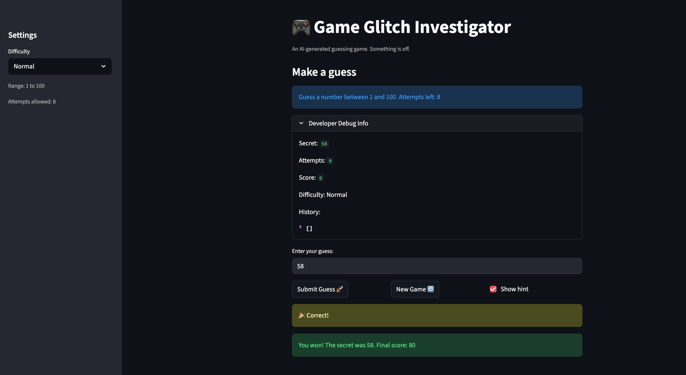

# 🎮 Game Glitch Investigator: The Impossible Guesser

## 🚨 The Situation

You asked an AI to build a simple "Number Guessing Game" using Streamlit.
It wrote the code, ran away, and now the game is unplayable. 

- You can't win.
- The hints lie to you.
- The secret number seems to have commitment issues.

## 🛠️ Setup

1. Install dependencies: `pip install -r requirements.txt`
2. Run the broken app: `python -m streamlit run app.py`

## 🕵️‍♂️ Your Mission

1. **Play the game.** Open the "Developer Debug Info" tab in the app to see the secret number. Try to win.
2. **Find the State Bug.** Why does the secret number change every time you click "Submit"? Ask ChatGPT: *"How do I keep a variable from resetting in Streamlit when I click a button?"*
3. **Fix the Logic.** The hints ("Higher/Lower") are wrong. Fix them.
4. **Refactor & Test.** - Move the logic into `logic_utils.py`.
   - Run `pytest` in your terminal.
   - Keep fixing until all tests pass!

## 📝 Document Your Experience

- [x] **Game purpose:** A number guessing game built with Streamlit. The player picks a difficulty (Easy, Normal, Hard), then tries to guess a randomly chosen secret number within a limited number of attempts. After each guess, the game gives a hint ("Too High" / "Too Low") and updates a score.

- [x] **Bugs found:**
  1. **Hint direction reversed** — "Too High" told the player to go higher, and "Too Low" told them to go lower. The messages were swapped.
  2. **Type confusion on even attempts** — Every second guess, the secret number was cast to a string before comparison. String ordering breaks numeric ordering (e.g. `"9" > "15"`), so hints flipped direction unpredictably — making the target feel like it was moving.
  3. **Hard difficulty was easier than Normal** — Hard returned the range (1, 50), which is narrower than Normal's (1, 100).
  4. **Score rewarded wrong guesses** — `update_score` added +5 points for "Too High" on even attempts instead of penalizing.
  5. **Hardcoded range in UI** — The info banner always said "between 1 and 100" regardless of selected difficulty.
  6. **New Game ignored difficulty** — The New Game button always reset the secret using `randint(1, 100)` instead of the active difficulty range, and didn't reset `status` or `history`.
  7. **`logic_utils.py` unimplemented** — All four functions raised `NotImplementedError`; logic was never refactored out of `app.py`.
  8. **`altair<5` in requirements** — Pinned altair to v4, conflicting with modern Streamlit (1.28+) which requires altair 5.

- [x] **Fixes applied:**
  1. Swapped hint messages: "Too High" → "Go LOWER!" and "Too Low" → "Go HIGHER!".
  2. Removed the even/odd string-cast logic; `check_guess` in `logic_utils` always compares integers.
  3. Changed Hard difficulty range to (1, 500).
  4. Simplified `update_score` to always subtract 5 for any wrong guess.
  5. Updated the info banner to display the actual range from `get_range_for_difficulty`.
  6. Fixed New Game to use the current difficulty range and reset all session state fields.
  7. Implemented all four functions in `logic_utils.py`; `app.py` now imports from it. `check_guess` returns a plain string outcome matching what the tests expect.
  8. Updated `requirements.txt` to `altair>=5`.

## 📸 Demo

## 🚀 Stretch Features

- [ ] [If you choose to complete Challenge 4, insert a screenshot of your Enhanced Game UI here]
